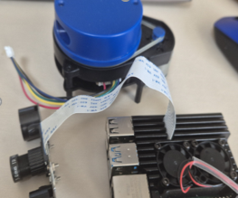

# 🐕 Quadruped Robot Sensor Fusion System
라즈베리파이를 이용한 4족 보행 로봇용 카메라 및 센서 융합 시스템

---

## 📌 프로젝트 개요
본 프로젝트는 라즈베리파이 4B를 기반으로 LiDAR와 카메라를 결합하여  
4족 보행 로봇의 자율주행을 위한 환경 인지 시스템을 구현하는 것을 목표로 한다.  

저비용 센서를 활용하면서도 실시간 SLAM 및 객체 인식 기능을 통합하여  
효율적인 인지-판단 시스템을 개발한다.

---

## 🎯 프로젝트 목표
- LiDAR 기반 실시간 SLAM 구현  
- 카메라 기반 객체 인식  
- 센서 퓨전 기반 장애물 회피  
- ROS2 기반 자율주행 시스템 구축  
- 4족 보행 로봇 적용 및 성능 검증  

---

## 🧠 시스템 구성
- Raspberry Pi 4B (메인 제어)  
- YDLIDAR X2 (거리 센서)  
- CSI Camera (영상 센서)  
- ROS2 Jazzy  
- Ubuntu 24.04 LTS  

---

## 🛠️ 기술 스택
- OS: Ubuntu 24.04.4 LTS  
- Framework: ROS2 Jazzy  
- Language: Python  
- Sensors: YDLIDAR X2, Camera  
- Tools: RViz2, SSH  
- Libraries: OpenCV, sensor_msgs  

---

## ⚙️ 주요 기능

### 1. SLAM (Simultaneous Localization and Mapping)
- LiDAR 데이터를 활용한 실시간 지도 생성  
- ROS2 기반 SLAM 패키지 적용  

### 2. 객체 인식
- 카메라 영상 기반 장애물 및 환경 인식  
- OpenCV 활용  

### 3. 센서 퓨전
- LiDAR + Camera 데이터 통합 처리  
- 보다 정확한 환경 인지 구현  

### 4. 장애물 회피
- 실시간 거리 데이터 기반 경로 수정  
- 자율 주행 안정성 향상  

---

## 🔌 개발 환경
- Raspberry Pi ↔ PC SSH 연결  
- 원격 개발 및 실시간 데이터 모니터링  
- RViz2를 통한 센서 데이터 시각화  

---

## 🚀 개발 과정

### 1단계: 환경 구축
- Ubuntu 및 ROS2 Jazzy 설치  
- SSH 네트워크 연결 구성  

### 2단계: 센서 연결
- YDLIDAR SDK 빌드 및 실행  
- 카메라 드라이버 설정  

### 3단계: SLAM 구현
- LiDAR 기반 지도 생성  
- RViz2로 실시간 확인  

### 4단계: 센서 융합
- LiDAR + Camera 데이터 통합  
- 인지 알고리즘 개발  

### 5단계: 로봇 적용 및 테스트
- 4족 로봇 적용  
- 장애물 회피 및 주행 테스트  

---

## 📊 결과 (추가 예정)
- SLAM 지도 생성 결과  
- RViz 시각화 이미지  
- 자율주행 테스트 영상  

---

## 💡 기대 효과
- 저비용 센서 기반 자율주행 시스템 구현  
- ROS2 기반 로봇 개발 역량 향상  
- 실제 산업 적용 가능한 인지 시스템 설계 경험  

---

## 👩‍💻 역할
- 센서 인터페이스 구현  
- SLAM 및 인지 알고리즘 개발  
- ROS2 노드 설계 및 통합  
- SSH 기반 원격 개발 환경 구축  

---

## 📎 참고
- ROS2 Jazzy  
- YDLIDAR SDK

  ---

## 📅 주차별 진행 내용

### 🔹 3주차 (2026.03.17)

#### 🛠️ 환경 구축
- VMware 설치
- Ubuntu 24.04.3 설치
- ROS2 Jazzy 설치 및 정상 동작 확인
- ROS2 송수신 테스트 진행

#### 🍓 라즈베리파이 세팅
- Raspberry Pi Imager 설치
- OS 이미지 굽기
- SD카드 삽입 및 초기 설정
- SSH 연결 성공

#### 📌 결과
- ROS2 개발 환경 구축 완료
- 라즈베리파이 원격 제어 환경 구축

---

### 🔜 다음주 계획
- ROS2 기반 센서 드라이버 구축
- YDLIDAR X2 연동 및 데이터 수집
- 카메라 영상 스트리밍 설정
- RViz2 시각화 테스트

  ---

## 📸 하드웨어 구성

라즈베리파이와 LiDAR 센서, 카메라를 이용한 실제 하드웨어 구성입니다.

